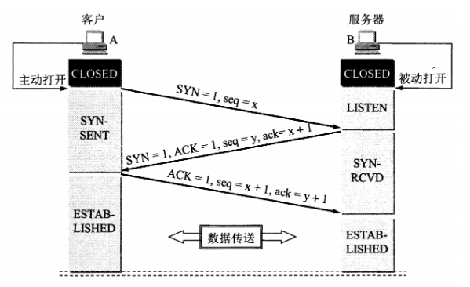
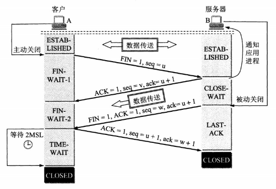

# 网络

## TCP相关

TCP（传输控制协议）是面向连接的协议，提供可靠的，保证消息顺序的网络传输服务，建立连接时会有三次握手，释放连接时会有四次挥手，以此保证连接的可靠性。

### 1. TCP三次握手

#### 流程

1. 在发起连接之前，服务端B上线，且处于`LISTEN`（监听状态），等待客户端的连接请求；
2. 客户端A主动发起连接请求报文（SYN），首部中同步位SYN=1，确认位ACK=0，初始序号为seq=x（SYN报文段不能携带数据），发送完成后，A将进入`SYN_SENT`（同步已发送状态）；
3. 服务端B收到来自客户端的请求报文后，决定是否连接，若同意建立连接，则向客户端发送链接确认报文（SYN+ACK），首部中同步位SYN=1，确认位ACK=1，初始序号为seq=y，确认号为ack=x+1（SYN报文段不能携带数据），发送完成后，B将进入`SYN_RCVD`（同步收到状态）；
4. 客户端A收到来自服务端的确认报文后，还需要向服务端最终确认（ACK），发送的报文首部中确认位ACK=1，序号seq=x+1，确认号ack=y+1（ACK报文可携带数据，若不携带数据则不消耗序号，下次发送报文序号仍旧是seq=x+1）；
5. 服务端B收到了客户端的确认，至此AB均进入`ESTABLISHED`（连接建立状态）。

#### 为什么是三次握手而不是两次或者四次？

- 三次就已经可以建立连接了，四次会浪费资源

- 第三次握手是为了防止服务端B突然收到了**已经失效的连接请求报文**而去打开错误连接。

  考虑到网络环境的问题，假设客户端在发送了一次连接请求报文后，因在某些网络节点滞留较长时间，迟迟没有收到来自服务端的确认报文，因此在超过了一个超时重传时间后，再次发起连接请求，这次连接成功建立...完成了任务后释放了连接，这时服务器才第一个连接请求报文，以为是客户端又发起的连接请求，于是确认连接，并初始化连接资源，如此造成了资源浪费。如果有第三次握手的话，客户端会略过服务器的确认报文，因此并不会打开本次连接。

#### 第三次ACK包丢失怎么办？

- server：server此时处在SYN_RECV状态，根据TCP超时重传机制，在预定重传次数里重新发送SYN+ACK包；
- client：client在接收到SYN+ACK包后就进入ESTABLISHED状态，向服务端发送数据，服务端会回复RST包（强制关闭连接），client此时可以察觉到错误。

#### 半连接队列

服务器在发送完确认连接报文（SYN+ACK）后进入`SYN_RCVD`状态，此时会将这种尚未完成状态的连接保存在一个半连接列队中，列队里其他项也全是类似这种还没有完全完成的连接。

在收到客户端的最终确认包（ACK）表示完成连接，或者超过了SYN_ACK的最大重传次数，都会将该半连接从队列中移除。

#### 利用TCP三次握手的洪泛攻击 SYN Flood

在服务端发送完确认连接报文（SYN+ACK）进入`SYN_RCVD`状态后，迟迟未收到客户端的最终确认报文（ACK），此时会不断再次发送确认连接报文，并会在一段时间内等待客户端发来的最终确认报文，这段时间长度称为`SYN Timeout`（30s~2min），若这段时间仍旧未收到则丢弃该未完成的连接。

SYN Flood攻击就利用服务器会等待一段时间，发起巨量的半连接而消耗服务端的资源（占满了半连接队列），最终导致服务端无法响应正常的连接请求。

- 解决方案
  1. 在客户端和服务器中间架设防火墙，客户端先跟防火墙建立三次握手连接后，防火墙再与服务端建立三次握手连接，此后CS通信会通过防火墙来转发数据。
  2. 缩短`SYN Timeout`...

### 2. TCP四次挥手

因为TCP连接是全双工通信，连接建立好后，客户端与服务端均为`ESTABLISHED`状态，故客户端和服务端均可主动发起关闭连接的请求。同时全双工带来的是TCP半关闭的性质，即关闭了自己发送数据的通道，但是仍旧可以接收数据。

#### 流程

1. 客户端A发出连接释放报文（FIN），其中首部 终止位FIN=1，序号seq=u，发送完成后客户端算是关闭了TCP连接，进入`FIN_WAIT_1`（终止等待1状态），等待服务端的确认；

2. 服务端B收到连接释放请求后，会发送ACK确认报文，确认位ACK=1，序号seq=v，确认号ack=u+1，表明服务端已经收到了连接关闭请求，服务端进入`CLOSE_WAIT`（等待关闭状态）。此时仍旧可以向客户端发送数据；

   > 此时TCP连接处于半关闭状态，客户端到服务端连接被关闭，即A可接受B数据，A不能向B发数据。

3. 客户端接收到服务端的确认报文后，进入`FIN_WAIT_2`（终止等待2状态）；

4. 待服务端发送完了数据，想要关闭连接了，会给客户端发送连接释放报文（FIN+ACK），首部 终止位FIN=1，确认位ACK=1，序号seq=w，确认号ack=u+1，这时服务器进入`LAST_ACK`（最后确认状态），等待客户端的确认；

5. 客户端收到连接释放报文后，类似于第二次挥手服务端的工作一样，会给服务端发送一个ACK确认报文，确认位ACK=1，序号seq=u+1，确认号ack=w+1，然后进入`TIME_WAIT`（时间等待状态）；

6. 服务端收到来自客户端的ACK报文后就会进入`CLOSED`（关闭状态）；

7. 客户端会等**2MSL**时长后，以确保服务端收到了ACK报文才从`TIME_WAIT`进入`CLOSED`（关闭状态）。

#### 为什么挥手次数需要四次？

前面有说过TCP连接是全双工通信，每次一个FIN报文加一个ACK报文一来一回才能关闭一个通道的连接，故需要需要两边都发送FIN报文再回复ACK报文才能保证两边都释放了连接。

#### 为什么要进入TIME_WAIT还要等2MSL才能进入CLOSED？

1. 确保最后一个ACK报文不丢失。

   假设因为网络环境原因，服务端没有收到最后一个ACK报文，则会重发连接释放报文，客户端在这段等待时间里收到了服务器新发来的释放连接报文，会再次重发最后一个ACK报文，保证服务端正常释放连接！

2. 保证本次连接中没有任何存活的报文。

   在`TIME_WAIT`状态下，客户端和服务端的端口不能使用，需要等到2MSL时间结束后才能继续使用。由于网络环境原因，客户端可能重传过连接请求报文，这类报文在连接释放后的2MSL时间内，就不会再次发起连接请求了。

   > MSL（Maximum Segment Lifetime，报文最大生存时间），在网络中超过这个时间的报文都将丢弃。

### 超时重传，拥塞控制，滑动窗口

参考 [CS-Notes/notes/计算机网络-传输层](https://github.com/CyC2018/CS-Notes/blob/master/notes/计算机网络%20-%20传输层.md#tcp-可靠传输)

## UDP相关

UDP是一个简单的无连接的，面向数据报的，只提供不可靠传递的网络传输服务。

#### TCP与UDP区别

|  Metric  |                             TCP                              |                       UDP                       |
| :------: | :----------------------------------------------------------: | :---------------------------------------------: |
|   连接   |           TCP基于连接，在通信前需要先完成三次握手            |    UDP是无连接协议，在通信前不需要发连接消息    |
|  可靠性  |    TCP有超时重传机制，丢包了会重发，确保数据传输的完整性     |           UDP不会保证传输不会丢失数据           |
|  有序性  |               通过滑动窗口，保证接收数据的顺序               |            UDP本身不保证数据的有序性            |
| 数据边界 |          TCP以流的形式放松数据，没有明显的数据边界           | UDP传输的数据包，包有明确的界限确定哪些包已收到 |
|   速度   | TCP慢，因为需要做的事太多，比如创建连接，保证可靠性与有序性，有许多机制 |                 UDP快，他更简单                 |
|   量级   |                          重量级协议                          |                   轻量级协议                    |
|  头大小  |            TCP报头大小20字节，包含了更多复杂信息             |                 UDP头大小8字节                  |
| 拥塞控制 |       TCP有拥塞控制：慢开始，拥塞避免，快重传，快恢复        |       UDP没有，需要其他层面去解决拥塞问题       |
|   用途   |    适用于需要可靠交付以及顺序性有要求的场景，比如金融支付    |      适用于对传输速率高要求的场景，如游戏       |

## 应用层相关

### 1. 域名解析过程

1. 浏览器首先在自己缓存里查找有没有域名到ip的映射，若没有走2；
2. 操作系统在本地hosts文件查找是否有域名到ip的映射；若没有走3；

> 以上为查询本地dns缓存

#### 以下为DNS域名解析过程 （递归+迭代）

3. 客户端向本地域名服务器（LDNS）查询映射ip，一般该域名服务器由接入运营商就近提供的。一般该域名服务器会缓存下解析结果，直接返回ip，若仍旧没有走4；
4. LDNS会向根域名服务器（Root DNS Server）发起解析请求，根域名服务器会给LDNS返回一个顶级域名（gTLD）服务器地址（全球13台），接着走5；
5. LDNS会向顶级域名服务器发起解析请求，gTLD服务器会查找并返回该域名对应的权威域服务器地址，接着走6；
6. LDNS向权威域服务器发起解析请求，最终获得域名对应的IP，返回给客户端，并将该域名与IP的映射缓存起来。

> 参考Wikipedia [域名系统](https://zh.wikipedia.org/wiki/域名系统) 里的域名解析部分。

### 2. HTTP相关

基础参阅：[CS-Notes/notes/HTTP]( https://github.com/CyC2018/CS-Notes/blob/master/notes/HTTP.md )

### 3. HTTPS相关

HTTPS使用了隧道进行通信，即是让HTTP先和SSL(TSL)通信，然后SSL(TSL)和TCP通信。

中间涉及了对称加密和非对称加密，以及证书和数字签名。

- **对称加密**

  加密解密的密钥相同，加解密速度快，但是泄漏密钥会让加密不安全。

- **非对称加密**

  加解密的密钥不同，分公钥和私钥，公钥加密的密文只能用私钥解密，私钥加密的密文只能用公钥解密，加密过程更加安全，但是速度会比较慢。

因此使用非对称加密加密对称加密的密钥，双方获取到密钥后只用使用对称加密加密数据即可，因此解决了非对称慢，对称安全性不够的问题。

但事实上这样容易受到**中间人攻击**，因此引入了**证书**以及**数字签名**，

- **证书，数字签名**

  用可信第三方**CA**证明大家的真实性，**证书**中包含了个人基本信息以及公钥，然后**CA**利用证书内容通过hash算出消息摘要，再使用**CA**的私钥加密生成了**数字签名**。只要拿到证书与数字签名，对证书内容做同样的hash算出消息摘要，对数字签名用CA的公钥解密，比对两者的一致性即可判断是否有中间人篡改过内容。

#### 流程

1. 客户端向服务端发送请求；
2. 服务端返回自己的数字证书；
3. 客户端利用自己的CA公钥解密证书，判断证书合法性；
4. 如果证书没问题，客户端生成对称加密用的随机秘钥，使用服务器证书里的公钥对随机秘钥加密，发送给服务端；
5. 服务端收到密文后用自己的私钥解密，获得对称加密使用的随机秘钥；
6. 此后双发通信就可以使用对称加密加密数据了。

### 4. HTTP/2相关

#### 二进制分帧

相比于HTTP/1.x以文本方式发送数据，HTTP/2将所有传输数据分割成了更小的消息和帧的概念，并且通过二进制格式编码。

-  *数据流*：已建立的连接内的双向字节流，可以承载一条或多条消息。 
-  *消息*：与逻辑请求或响应消息对应的完整的一系列帧。 
-  *帧*：HTTP/2 通信的最小单位，每个帧都包含帧头，至少也会标识出当前帧所属的数据流。 

HTTP/2将数据流以消息方式发送，消息由多帧组成，多帧可乱序发送，顺序组装，且均在一个TCP连接内复用。

#### 多路复用

同域名下的所有通信都在单个TCP连接上完成，单个连接可以承载任意数量的双向数据流，故在并发请求时无需向HTTP/1.x建立多条连接，仅在单个TCP连接内即可完成，且发送的消息分割成了互不相干的帧，交错发送出去，另一端重新组装即可。

>  解决了 HTTP/1.x 中存在的队首阻塞问题，也消除了并行处理和发送请求及响应时对多个连接的依赖。 结果，应用速度更快、开发更简单、部署成本更低。 

#### 服务器推送

服务端向客户端发送比请求更多的数据，譬如客户端请求了某个html文件，服务端会主动把相关css，javascript文件也提前发给客户端，避免了客户端再次发起新一轮请求，节约加载时间。

#### 头部压缩

- 客户端和服务端使用**索引列表**保存了之前发送过的头部的键值对，对于相同的数据就不再重复发送了；
- 通过静态**霍夫曼编码**对头部字段进行编码压缩。

### 5. QUIC相关

## socket相关

参阅：[CS-Notes/notes/Socket](https://github.com/CyC2018/CS-Notes/blob/master/notes/Socket.md)

I/O复用：select、poll、epoll参考：[select、poll、epoll之间的区别总结整理](https://www.cnblogs.com/Anker/p/3265058.html)

- select的几大缺点：
>
> （1）每次调用select，都需要把fd集合从用户态拷贝到内核态，这个开销在fd很多时会很大
>
> （2）同时每次调用select都需要在内核遍历传递进来的所有fd，这个开销在fd很多时也很大
>
> （3）select支持的文件描述符数量太小了，默认是1024

- poll类似，不过poll没有文件描述符上限

> epoll将select和poll一个函数的工作分散到三个函数上，epoll_create，epoll_ctl，epoll_wait。
>
> （1）epoll注册新事件时是通过epoll_ctl将文件描述符拷贝到内核态的，而不是epoll_wait时的重复拷贝，因此保证每个fd仅被拷贝一次
>
> （2）epoll在epoll_ctl时遍历每个fd，加入到等待队列（ 红黑树 ）中，并设定一个回调函数，当就绪后回调函数会将I/O准备好的描述符加入到就绪链表中管理，而epoll_wait只用查看就绪链表中是否有就绪的fd即可。
>
> （3）epoll没有文件描述符上限，/proc/sys/fs/file-max文件保存系统支持的文件描述符上限。

- epoll：适用连接特别多，活跃的连接特别少的场景。

> LT：水平触发，进程没有处理的fd会再次加入就绪链表，下次继续处理。
>
> ET：边缘触发，在有数据可读时必须把数据全部读完才能返回，否则容易产生饿死，只能用于非阻塞。（就绪状态只能：从无到有，或者新来数据）该模式效率更高，系统不会充斥大量不关心的就绪文件描述符

- 惊群：多进程（多线程）在同时阻塞等待同一个事件的时候（休眠状态），如果等待的这个事件发生，那么他就会唤醒等待的所有进程（或者线程），但是最终却只可能有一个进程（线程）获得这个时间的“控制权”，对该事件进行处理，而其他进程（线程）获取“控制权”失败，只能重新进入休眠状态，这种现象和性能浪费就叫做惊群。
  - accept：linux2.6之后只唤醒等待队列上第一个进程(线程)。
  - epoll_wait：linux3.9版本引入SO_REUSEPORT，允许多个socket绑定监听一个端口，内核层面的负载均衡（HASH mod），内核指派哪个socket去处理

## 终极之问

在浏览器输入url后，发生了什么？

### 1. 浏览器本地缓存；

   首先针对请求资源，浏览器在本地进行查找，如果本地有目标资源，而且强缓存显示资源尚未过期，则浏览器可直接加载该资源进行解析渲染；如果没有目标资源，或者强缓存显示失效，则需要发起`http`请求去请求资源或者让服务器判断缓存是否失效；

### 2. 物理层到应用层涉及的协议；

   向服务器发起`http/https`请求，会走`tcp/ip`5层协议，首先通过填充`http头部`字段（请求方法，url，协议版本，有必要的话加上Etag以及Last-Modified检测文件是否改变），其次完成`tcp头部`封装（两个端口号，序号确认号等，以及标志位），然后是`ip数据报首部`填充（源和目的ip），这里会使到[DNS解析](#1. 域名解析过程)出的url对应ip（这个业务可能接入了CDN，则会解析到最近的CDN节点），然后是链路层会封装数据成`帧`，其中MAC地址由ARP解析而来，最后通过物理信道在网络上传输该请求。

   - tcp三次握手、四次挥手
   - DNS域名解析
   - https的加密解密

### 3. CDN；

   如果业务接入了`CDN`，则有DNS解析的ip将是最优的`CDN`节点，然后浏览器与`CDN`服务器建立连接，`CDN`响应请求，查询本地是否缓存了目标资源，如果有缓存，则判断是返回304或者是200；而如果`CDN`缓存层没有该资源文件或者文件过期，则将回源。

   此外针对大文件，`CDN`通过会考虑使用**302**重定向请求，调度到真正合适的`CDN`节点。

> 考虑到浏览器所在客户端系统配置的本地DNS的地区并不是客户端所在地区的DNS服务器，故而DNS服务器返回的CDN节点IP将不是最优的，而对大文件来说这样会影响CDN的性能，故而采取两次请求的操作，第一次向CDN调度机器请求得到302返回后向其返回的ip再去请求资源，将是最优路径

### 4. 反向代理服务器；

   CDN缺失的请求，回源到数据源站，也就是应用的服务器，而在此之前，可能部署了反向代理服务器，反向代理服务器会缓存部分热点文件，如果反向代理服务器命中则直接返回数据资源给上一层（`CDN`）；否则继续转发请求到下一层；

### 5. 负载均衡调度服务器；

   针对一个大型架构的网站，后台一般由服务器集群组成提供分布式服务，因此首先可能请求到了负载均衡服务器，然后负载均衡服务器通过负载均衡算法，将该请求转发给后台集群中合适的服务器；

### 6. 应用服务器集群；

   至此，请求传到了应用服务器，服务器会向自己本地的缓存查询资源，若有缓存则可直接按原路径返回资源；否则向可能存在的分布式缓存查询；

### 7. 分布式缓存；

   在分布式缓存中查询目标资源是否存在，如果存在则返回给应用服务器，若没有则得去后台数据库中查询了；

### 8. 应用数据库服务器

   请求最终来到了数据库查询这一步，如果请求合法，这里一定会有目标资源，然后按原路返回，一路上该缓存的缓存；如果请求非法，则这里返回错误给服务器，服务器返回状态码等信息。

> 关于后面这么多结构的可能访问途径，参考《大型网站技术架构》

## 参考资料

[CS-Notes/notes/计算机网络-传输层](https://github.com/CyC2018/CS-Notes/blob/master/notes/计算机网络 - 传输层.md)

[深入理解 https 通信加密过程](https://klionsec.github.io/2017/07/31/https-learn/)

[一文读懂 HTTP/2 特性](https://zhuanlan.zhihu.com/p/26559480)

[HTTP/2 简介](https://developers.google.com/web/fundamentals/performance/http2?hl=zh-cn)

[技术扫盲：新一代基于UDP的低延时网络传输层协议——QUIC详解](http://www.52im.net/thread-1309-1-1.html)

[select、poll、epoll之间的区别总结整理](https://www.cnblogs.com/Anker/p/3265058.html)

[Linux惊群效应详解（最详细的了吧](https://blog.csdn.net/lyztyycode/article/details/78648798)

[浏览器发送http请求过程分析](https://segmentfault.com/a/1190000010156898)